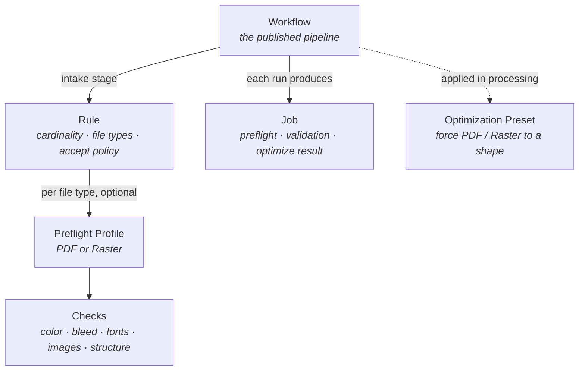

Everything you configure in the Filecheck admin is built from a small set of objects. Most live in your **Library** as independent, reusable pieces; you wire them together in a **Workflow**, and every file that runs through one produces a **Job**.

## The objects

<CardGroup cols={2}>
  <Card title="Rule" icon="upload">
    The customer-facing **intake gate**. Describes what a customer may upload for a product — how many files (cardinality), which file types, and whether each file is accepted, accepted with warnings, or rejected — synchronously, while the customer waits. A Rule references a Preflight Profile by id; it does not contain checks itself.
  </Card>
  <Card title="Preflight Profile" icon="magnifying-glass">
    A named set of **checks** that answer "what makes this file acceptable?" — color, bleed, fonts, resolution, structure. Comes in two kinds, **PDF** and **Raster**. Each check carries a severity: reject, warn, or info.
  </Card>
  <Card title="Workflow" icon="diagram-project">
    The **fulfillment pipeline**. It points at one Rule at intake, then defines what happens afterward: fixing, optimizing, splitting, merging, exporting. The only object you publish to customers.
  </Card>
  <Card title="Job" icon="receipt">
    One **run** of a file (or set of files) through preflight, validation, or optimization. Jobs are created by a Workflow, or manually in the admin. Each carries a result you can act on.
  </Card>
</CardGroup>

<Card title="Optimization Preset" icon="wand-magic-sparkles">
  A standalone transform that forces a PDF or Raster into a target shape — downsample images, convert color, flatten layers, strip metadata, outline text. Independent of the chain above; applied where you need a guaranteed output.
</Card>

## How they relate

A Workflow points at a Rule at its intake stage; the Rule (optionally) points at a Preflight Profile; the profile is made of checks. Running a file through the Workflow produces a Job. Optimization Presets sit to the side — applied in a workflow's processing stage, or run on their own.

<Note>
  **Naming:** a **Rule** is the standalone intake object (the Library tab is "Upload Rules"). The individual rules *inside* a Preflight Profile are called **checks** — different layer, different word.
</Note>

## Reuse is the point

Because Rules, Preflight Profiles, and Optimization Presets are independent Library objects, you build each once and reuse it everywhere. One "PDF/X-4 Compliant" profile can back the rules for posters, business cards, and packaging at the same time — edit it once and every workflow that uses it picks up the change.

## Where each is configured

| Object | Where in the admin |
| --- | --- |
| Workflow | **Workflows** tab |
| Rule | **Library → Upload Rules** |
| Preflight Profile (and its checks) | **Library → Preflight Profiles** |
| Optimization Preset | **Library → Optimization Presets** |
| Job | **Jobs** tab (and your store dashboard) |

<Card title="Configure these in the admin" icon="sliders" href="/configuration/overview">
  Step-by-step guides for building each object in the dashboard.
</Card>
