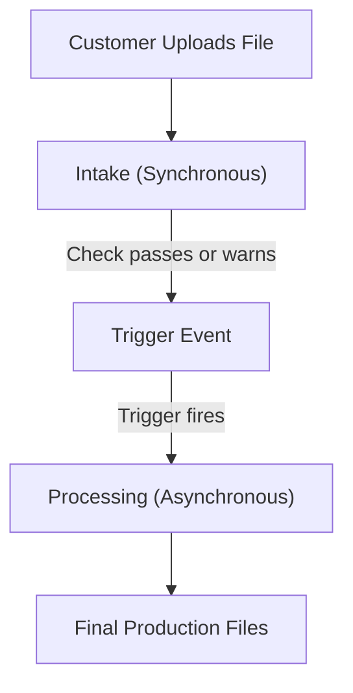

A **Workflow** is the automated processing stream configured in the Filecheck admin and assigned to your storefront products. It is the core operational pipeline of Filecheck, coordinating how files are received from customers, proofed, triggered, optimized, and packaged.

Each Workflow is uniquely identified by an ID (`wf_…`), which is automatically loaded as a select option in your e-commerce plugin, or passed to the front-end [Element](/element/create-and-mount) as the `workflowId`.

<Note>
  The option is `workflowId`, not `ruleId`. This is the most common integration mistake.
</Note>

## The workflow stream: divided in two

To keep your storefront fast and prevent wasting server resources on unpaid carts, every workflow is split into two sequential phases by a **trigger event**:

<CardGroup cols={2}>
  <Card title="1. Intake (Client waits)" icon="hourglass-half">
    Runs **while the customer is waiting** on the product page. The assigned [Upload Rule](/concepts/building-blocks) accepts the file, checks file type limits, and runs a **Preflight Profile** in milliseconds. This phase is optimized for speed; it only determines if the file is acceptable enough to proceed.
  </Card>
  <Card title="2. Processing (Triggered)" icon="gears">
    Runs **after a trigger event fires** (for example, once an order is placed). Since the client is no longer waiting, Filecheck can execute heavier asynchronous operations: automatically fixing files, downsampling images with **Optimization Presets**, splitting/merging pages, and bundling production-ready ZIPs.
  </Card>
</CardGroup>

---

## Trigger events: bridging the two phases

The **trigger** is the gatekeeper that tells Filecheck when to move files from the intake phase to the processing phase.

| Trigger Event | When Processing Starts... |
| --- | --- |
| **Once uploads are accepted** | Immediately after intake passes. Perfect for instant SaaS tools or live web tools. |
| **After customer approves soft-proof** | Once the customer reviews and signs off on their generated visual preview. |
| **After an order is placed** | When checkout completes (the standard choice for e-commerce, ensuring you only process paid orders). |
| **Manually from Admin Jobs** | Held in a queue until an administrator clicks **Run** from the Jobs dashboard. |
| **Via API / webhook** | Fired on demand when your custom external systems send an API request. |

---

## Mapping workflows to products

Instead of editing raw code, Filecheck plugins for **WooCommerce, Shopify, PrestaShop, and OpenCart** handle this automatically:
1. Under your store's general settings, you can assign a global **Default Workflow** from a dropdown list sync'd directly from your active Filecheck account.
2. Edit any specific product to override that default and map a specialized workflow (e.g., assigning a *Large Format Poster* workflow to a poster product, and a *Business Cards* workflow to card products).

<CardGroup cols={2}>
  <Card title="Building blocks" icon="cubes" href="/concepts/building-blocks">
    How Upload Rules, Profiles, Checks, and Presets fit together.
  </Card>
  <Card title="Build a workflow" icon="sliders" href="/configuration/workflows">
    Step-by-step setup guide in the dashboard.
  </Card>
</CardGroup>
