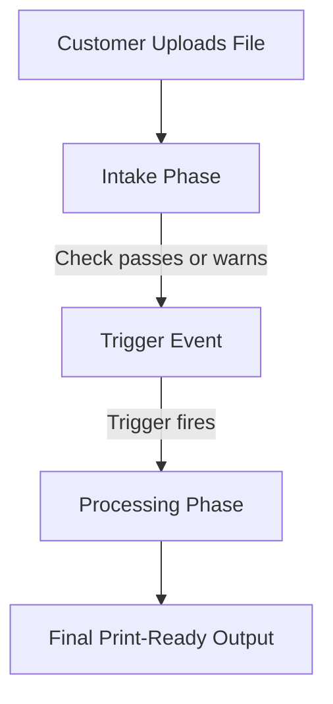

This guide is the hands-on companion to [Building blocks](/concepts/building-blocks). It walks through configuring each part of the Filecheck admin, how they connect, and how to build your pipelines from the ground up.

<Frame caption="Home — your Filecheck dashboard">
  
</Frame>

## The five core building blocks

To configure Filecheck, you need to understand how these five concepts work together:

<CardGroup cols={1}>
  <Card title="Preflight Profile" icon="magnifying-glass">
    A reusable set of checks (like bleed, fonts, resolution, and color space) that judges whether a PDF or raster file is print-ready.
  </Card>
  <Card title="Upload Rule" icon="door-open">
    The customer-facing intake gate. It defines what file formats are allowed, the **cardinality** (how many files), and assigns a preflight profile or validation standard to run while the customer waits.
  </Card>
  <Card title="Workflow" icon="diagram-project">
    The complete fulfillment pipeline. It binds an intake rule, soft-proofing, a trigger event, and downstream processing steps (like fixing, optimizing, splitting, and merging files) into a single cohesive flow.
  </Card>
  <Card title="Job" icon="receipt">
    A single run of a file or set of files through a pipeline or manual check. It records the status, errors or warnings, and holds the final downloadable output.
  </Card>
  <Card title="Optimization Preset" icon="wand-magic-sparkles">
    A standalone transform that unconditionally reshapes a file (compressing images, flattening layers, outlining text, converting colors) to force it into a target format.
  </Card>
</CardGroup>

---

## Create a preflight profile

A Preflight Profile defines the strict quality standards your files must meet. Profiles live in **Library → Preflight Profiles**.

There are two distinct types of profiles because different file formats require completely different checks:

<CardGroup cols={2}>
  <Card title="PDF profiles" icon="file-pdf" href="/configuration/preflight">
    Used to inspect PDF files. They check page geometry (bleed, trim, page count), color spaces (RGB, CMYK, spot colors), font embedding, minimum text sizes, and PDF structure.
  </Card>
  <Card title="Raster profiles" icon="image" href="/configuration/preflight">
    Used to inspect image files (JPEG, PNG, TIFF). They check image resolution (DPI), absolute pixel dimensions, color modes, and aspect ratios.
  </Card>
</CardGroup>

### How to configure a profile
1. Navigate to **Library → Preflight Profiles**.
2. Click **New Preflight Profile** and select either **New PDF Profile** or **New Raster Profile** (or clone an existing pre-loaded template).
3. Name your profile clearly (e.g., *Standard Poster PDF* or *T-Shirt Raster*).
4. Go through each check section and set your **Target** requirements (for example, bleed **Required 3 mm**).
5. Assign an **Action** for each check to decide what happens if a file fails:
   - **Reject**: Blocks the file immediately.
   - **Warn**: Flags the file but lets the customer proceed.
   - **Info / Fix**: Logs the issue or designates it to be repaired in the processing phase.
6. Click **Save**.

---

## Create an upload rule

An Upload Rule is the gatekeeper of your intake stream. It determines what files are accepted and how they are checked in real time. Rules live in **Library → Upload Rules**.

When creating an Upload Rule, you define:

### 1. Cardinality (how many files)
This sets the limits on how many files a customer can upload. You can choose:
*   **Count range**: Set a **MIN** and **MAX** number of files (e.g., exactly `1–1` for a single-page flyer, or `1–4` to allow up to four files).
*   **Named slots**: Set up specific slots for defined roles (e.g., a `Front` slot and a `Back` slot for double-sided business cards). This creates separate, labeled drop targets for your customers.

### 2. Preflight or validation
For each accepted file type, you can set how it is checked synchronously while the customer waits:
*   **Preflight against a profile**: Assign one of your Preflight Profiles (PDF profile for PDF files, Raster profile for images) to check the artwork against your custom rules.
*   **Validation against a standard**: Validate the file against official standards like **PDF/A** or **PDF/UA** (for accessibility) rather than running a custom checklist.

### 3. On-fail policy
Set what happens if a file fails its preflight check:
*   **Reject**: The file is blocked. The customer must resolve the issue and upload a new file before they can proceed.
*   **Accept with warnings**: The file is accepted but flagged. The customer can proceed with warnings.
*   **Manual review**: The file is accepted but held in a queue for an admin to approve before it goes to production.

This policy determines the `canProceed` flag that controls your checkout's submit button.

---

## Build a workflow and assign a rule

A Workflow is the backbone of your automation. It coordinates the two distinct phases of a file's journey, separated by a **trigger**.

<Frame caption="Workflows — start from a template or create a new one">
  
</Frame>

### The two phases of a workflow

Every workflow stream is divided into two sequential phases:

1.  **Intake**: Runs **while the customer is waiting**. The assigned Upload Rule runs its preflight or validation check. This phase is optimized to be incredibly fast. It does not perform heavy file modifications; it only decides if the file is acceptable so that the customer can proceed.
2.  **Processing**: Runs **after a trigger event fires**. It does not run while the customer waits. Because the customer has already checked out or approved the file, Filecheck can perform heavier, more intensive processing steps here:
    *   **Auto-fixing**: Automatically corrects file issues (like scaling, small bleed adjustments, and missing colors) based on the findings from the intake preflight.
    *   **Optimizing**: Uses an **Optimization Preset** to downsample images, outline text, convert color spaces, or thicken lines.
    *   **Splitting & merging**: Splits multi-page PDFs or merges several uploaded files into a single consolidated PDF or ZIP file.

### How to configure a workflow
1. Navigate to the **Workflows** tab and click **New Workflow** (or choose a product template).
2. Under the **Intake / Upload Rule** stage, assign your previously created Upload Rule.
3. Toggle **Soft-proofing** on if you want to generate a web-friendly preview for customer approval before continuing.
4. Set the **Trigger** to decide exactly when the processing phase should begin. Common options include:
    *   **Once uploads are accepted**: Runs processing immediately after a successful intake.
    *   **After customer approves soft-proof**: Runs once the customer signs off on the generated preview.
    *   **After an order is placed**: Runs when the e-commerce checkout is complete. This is the recommended choice for store integrations as it saves processing power on abandoned carts.
    *   **Manually from Admin Jobs**: Runs only when you click **Run** on the job details page.
    *   **Via API / webhook**: Runs when your external system sends a webhook or API signal.
5. Define your **Processing** and **Merge** options to dictate your final output shape.
6. Save the workflow to receive its unique ID (`wf_…`). You can reference this `workflowId` in your embeddable **Element** or select it in your e-commerce plugin.

---

## Retrieve your job output

Once a Job finishes processing, you can access the optimized, print-ready files in two places:

<CardGroup cols={2}>
  <Card title="E-commerce store dashboard" icon="store">
    If you use one of our official integrations, the completed job output is attached directly to the order in your e-commerce platform's admin panel (**WordPress/WooCommerce, OpenCart, PrestaShop, or Shopify**). You can download print-ready assets directly from the order detail page.
  </Card>
  <Card title="The Filecheck portal" icon="table-list">
    You can log into your Filecheck account and navigate to **[admin.filecheck.io/jobs](https://admin.filecheck.io/jobs)** (the **Jobs** tab). Here, you can search for the job ID, view its full preflight report, and download the processed output files.
  </Card>
</CardGroup>

---

## Run a manual job without a workflow

You do not need to build a complete workflow or embed a widget to test files or run quick checks. You can create a job manually at any time.

Navigate to the **Jobs** tab and click the **New Job** button in the top right corner.

<Frame caption="New Job — run a quick manual check">
  
</Frame>

From here, you can run immediate, one-off checks and get results instantly:

*   **Run a Preflight**: Upload a PDF or raster file, select a Preflight Profile, and check its print-readiness. You can also trigger an automatic fix.
*   **Validate a PDF File**: Check any PDF for compliance against **PDF/A** or **PDF/UA** standards.
*   **Optimize a PDF File**: Select an **Optimization Preset** to downsample, outline, and compress a PDF file instantly.

This is the fastest way for administrators to spot-check a client's file, test a new preflight profile, or quickly fix an artwork file on the fly without performing a full workflow setup.

<Tip>
  Filecheck ships pre-loaded profile, rule, and workflow templates you can clone instead of starting from scratch. Most setups begin by cloning one and tweaking it.
</Tip>
