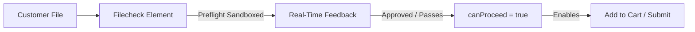

<Note>
  **Using an e-commerce platform?** If you are running WooCommerce, Shopify, OpenCart, or PrestaShop, you **do not need to write any code or manually embed this Element**.
  
  Simply install the respective Filecheck plugin/module and assign a Workflow to your products inside your store admin. The plugin will handle loading, mounting, and gating the Element automatically!
  
  **[Go to the Plugin Installation Guides →](/tutorials/overview)**
</Note>

The **Filecheck Element** is a secure, self-rendering front-end widget that embeds directly into your website's product page, upload form, or checkout stream. It sits in front of your action buttons (such as **Add to Cart** or **Submit**) and acts as the interactive portal where customers upload, preview, and approve their files.

---

## What the Element does

Integrating the Element on your frontend handles several critical jobs automatically:

*   **Secure, direct uploads**: Files are uploaded directly from the client to Filecheck's secure, sandboxed cloud infrastructure—keeping upload bandwidth off your web server.
*   **Real-time inspection feedback**: Filecheck inspects PDFs or raster images in milliseconds and displays clean, customer-friendly status banners directly inside the widget (e.g. reporting missing bleed, low DPI, or un-embedded fonts).
*   **Interactive soft-proofing**: If soft-proofing is enabled on the active [Workflow](/concepts/workflows), the Element renders a visual, high-fidelity crop and color preview for the customer to review and approve.
*   **Synchronous checkout gating**: The Element emits real-time status payloads. It exposes a **`canProceed`** flag which controls whether your store's purchase button remains locked or active.

---

## Two presentation modes

The Element can be styled to fit your storefront's user experience with two standard presentation modes:

<CardGroup cols={2}>
  <Card title="Inline presentation" icon="window-maximize">
    The upload target renders directly in the page flow as a drop-zone box. Ideal for products that always require custom artwork.
  </Card>
  <Card title="Dialog presentation" icon="window-restore">
    Renders as a customizable button (e.g., "Upload Artwork"). Clicking the button opens the upload interface in a secure modal/drawer dialog over the page.
  </Card>
</CardGroup>

---

## How it works under the hood

The Element is loaded dynamically from our CDN. Under the hood, it renders inside a secure iframe wrapped in a **Shadow DOM** boundary.
*   **Isolation**: Because it runs within a Shadow DOM, your store's style rules (such as global CSS styles) cannot break the widget's layout.
*   **Responsiveness**: The widget self-sizes dynamically based on its contents and state. You only need to set a fixed **width** on the parent container `
`; you should never hardcode a height.

---

## Integration options

Depending on your project's technical architecture, you can integrate the Element in two ways:

<CardGroup cols={2}>
  <Card title="Zero-JS (Plugins)" icon="puzzle-piece" href="/element/presentation">
    For WordPress, Shopify, OpenCart, and PrestaShop, use the simplified `Filecheck.mount(config)` API. It automatically handles mounting, button gating, dialog windows, and lightbox proof galleries with zero manual code.
  </Card>
  <Card title="Standard JS / Custom stacks" icon="code" href="/element/installation">
    Load the library from the CDN, initialize the `Filecheck` factory manually, subscribe to real-time events, and programmatically bind them to your custom checkout flow.
  </Card>
</CardGroup>
